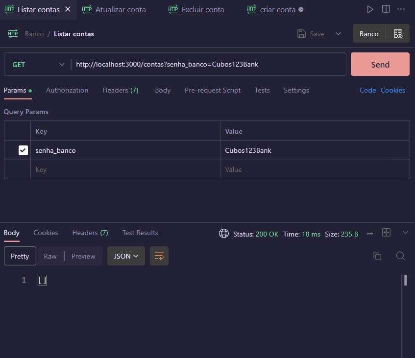
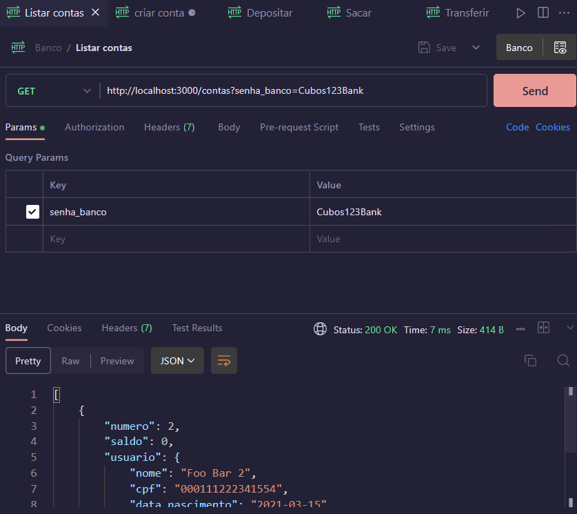
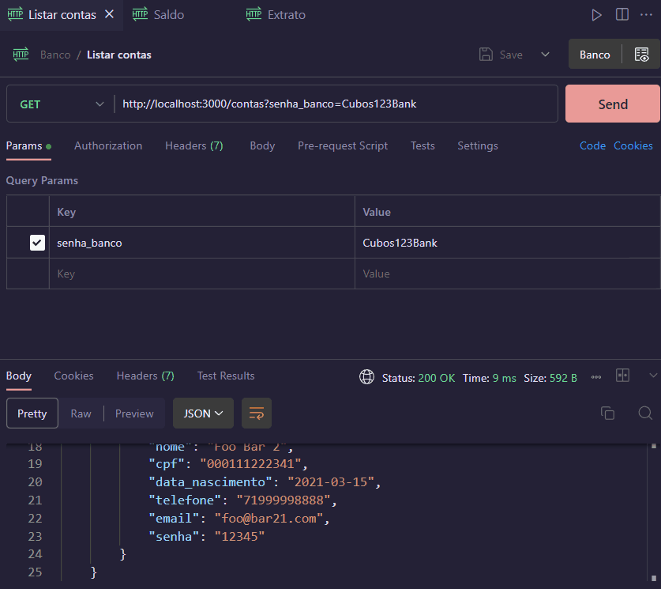

# API Sistema Bancário

## Sobre o projeto
Este projeto é resultado do Desafio do Módulo 2 do curso de Backend da Cubos Academy, no qual desenvolvi uma API REST de um sistema bancário que permite que as contas sejam criadas, listas, atualizadas e excluídas conforme as regras de negócio do Desafio. Além da criação de contas, é possível realizar as transações bancárias para sacar, depositar, transferir, verificar saldo e verificar extrato.
As regras do desafio estão disponíveis [aqui](README%20Desafio.md).

## Funcionalidades
 1) Listar Contas
 2)  Criar conta bancária
 3)  Atualizar conta bancária
 4)  Excluir conta bancária
 5)  Realizar depósito
 6)  Realizar saque
 7) Realizar transferência
 8) Verificar Saldo
 9) Verificar Extrato


## Como executar o projeto
Para executar este projeto é necessário ter o nodejs instalado.
Faça um clone do projeto
```bash
git clone https://github.com/Daaaiii/desafio-backend-m02-b2bt05.git
```
Abre o diretório do projeto
```bash
cd desafio-backend-m02-b2bt05
```

Instale as dependências utilizando o comando:
```bash
npm i
```

Inicialize o servidor local: 
```bash
npm run dev
```
Para verificar as rotas pode-se importar o arquivo `Banco.postman_collection.json` no Postman ou Insomnia ou utilizar a extensão do Postman no VsCode.

## Verificando as rotas


1) **Listar contas bancárias**

 #### `GET` `/contas?senha_banco=Cubos123Bank`

 Esse endpoint deverá listar todas as contas bancárias existentes.

 Validações: 

        -   Verificar se a senha do banco foi informada (passado como query params na url)
        -   Validar se a senha do banco está correta

2) **Criar conta bancária**

#### `POST` `/contas`

Esse endpoint deverá criar uma conta bancária, onde será gerado um número único para identificação da conta (número da conta).

Validações:

    -   Criar uma nova conta cujo número é único
    -   CPF deve ser um campo único.
    -   E-mail deve ser um campo único.
    -   Verificar se todos os campos foram informados (todos são obrigatórios)
    -   Definir o saldo inicial da conta como 0

3) **Atualizar usuário da conta bancária**

#### `PUT` `/contas/:numeroConta/usuario`

Esse endpoint deverá atualizar apenas os dados do usuário de uma conta bancária.

Validações:

    -   Verificar se foi passado todos os campos no body da requisição
    -   Verificar se o numero da conta passado como parametro na URL é válida
    -   Se o CPF for informado, verificar se já existe outro registro com o mesmo CPF
    -   Se o E-mail for informado, verificar se já existe outro registro com o mesmo E-mail
    -   Atualizar os dados do usuário de uma conta bancária

4) **Excluir conta**

#### `DELETE` `/contas/:numeroConta`

Esse endpoint deve excluir uma conta bancária existente.

Validações: 

    -   Verificar se o numero da conta passado como parametro na URL é válido
    -   Permitir excluir uma conta bancária apenas se o saldo for 0 (zero)
    -   Remover a conta do objeto de persistência de dados.




5) **Depositar**

#### `POST` `/transacoes/depositar`

Esse endpoint deverá somar o valor do depósito ao saldo de uma conta válida e registrar essa transação.

Validações:

    -   Verificar se o numero da conta e o valor do deposito foram informados no body
    -   Verificar se a conta bancária informada existe
    -   Não permitir depósitos com valores negativos ou zerados
    -   Somar o valor de depósito ao saldo da conta encontrada

6) **Sacar**

#### `POST` `/transacoes/sacar`

Esse endpoint deverá realizar o saque de um valor em uma determinada conta bancária e registrar essa transação.

Validações:

    -   Verificar se o numero da conta, o valor do saque e a senha foram informados no body
    -   Verificar se a conta bancária informada existe
    -   Verificar se a senha informada é uma senha válida para a conta informada
    -   Verificar se há saldo disponível para saque
    -   Subtrair o valor sacado do saldo da conta encontrada

7) **Transferir**

#### `POST` `/transacoes/transferir`

Esse endpoint deverá permitir a transferência de recursos (dinheiro) de uma conta bancária para outra e registrar essa transação.

Validações:

    -   Verificar se o número da conta de origem, de destino, senha da conta de origem e valor da transferência foram informados no body
    -   Verificar se a conta bancária de origem informada existe
    -   Verificar se a conta bancária de destino informada existe
    -   Verificar se a senha informada é uma senha válida para a conta de origem informada
    -   Verificar se há saldo disponível na conta de origem para a transferência
    -   Subtrair o valor da transfência do saldo na conta de origem
    -   Somar o valor da transferência no saldo da conta de destino




8) **Saldo**

#### `GET` `/contas/saldo?numero_conta=123&senha=123`

Esse endpoint deverá retornar o saldo de uma conta bancária.

Validações:

    -   Verificar se o numero da conta e a senha foram informadas (passado como query params na url)
    -   Verificar se a conta bancária informada existe
    -   Verificar se a senha informada é uma senha válida
    -   Exibir o saldo da conta bancária em questão


9) **Extrato**

#### `GET` `/contas/extrato?numero_conta=123&senha=123`

Esse endpoint deverá listar as transações realizadas de uma conta específica.

Validações:

    -   Verificar se o numero da conta e a senha foram informadas (passado como query params na url)
    -   Verificar se a conta bancária informada existe
    -   Verificar se a senha informada é uma senha válida
    -   Retornar a lista de transferências, depósitos e saques da conta em questão.


## Tecnologias Utilizadas
[](https://skillicons.dev)

## Como contribuir para o projeto
1. Faça um fork do projeto.
2. Crie uma nova branch com as suas alterações: `git checkout -b my-feature`
3. Salve as alterações e crie uma mensagem de commit contanto o que você fez: `git commit -m "feature: My new feature"`
4. Envie as alterações: `git push origin my-feature`

## Autora
[Daiane Bolzan](https://www.linkedin.com/in/daiane-deponti-bolzan/)


## Licença
[MIT](LICENSE)